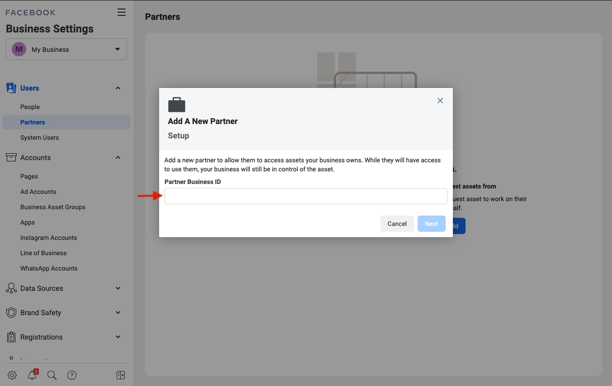
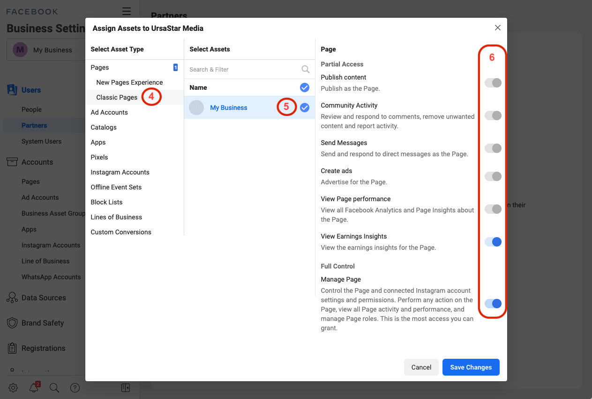
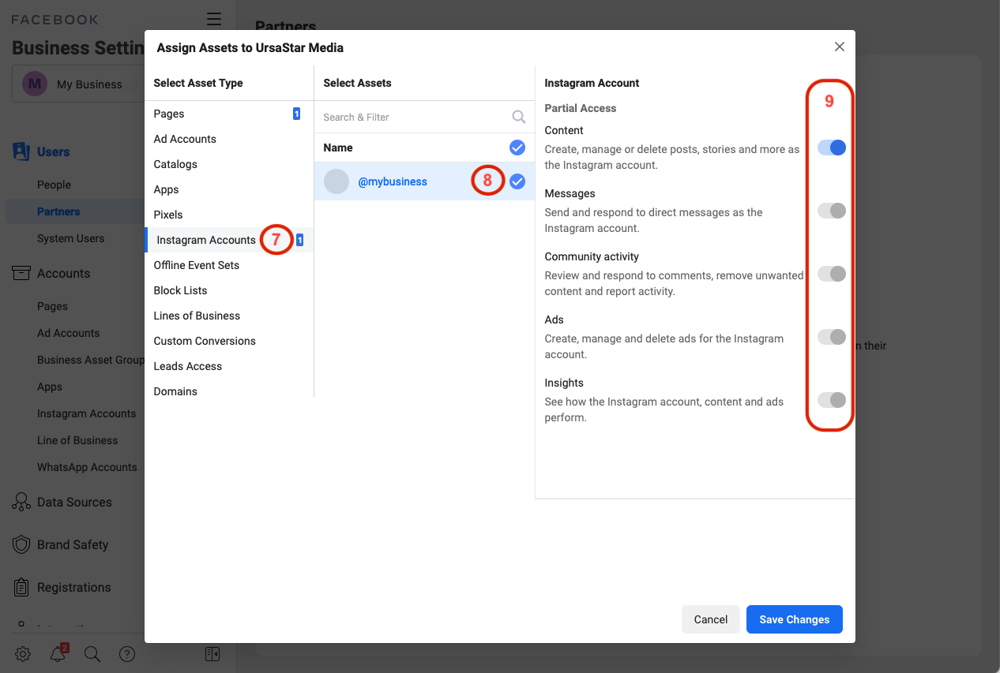
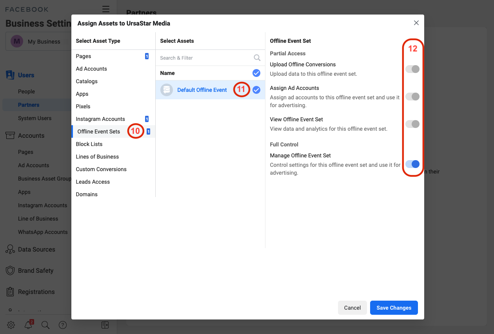
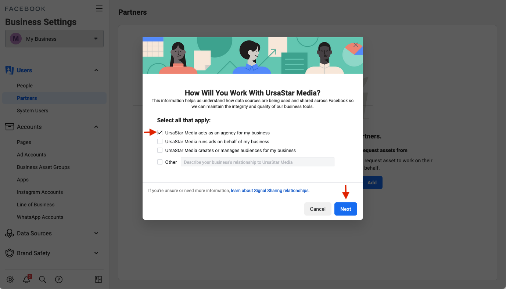
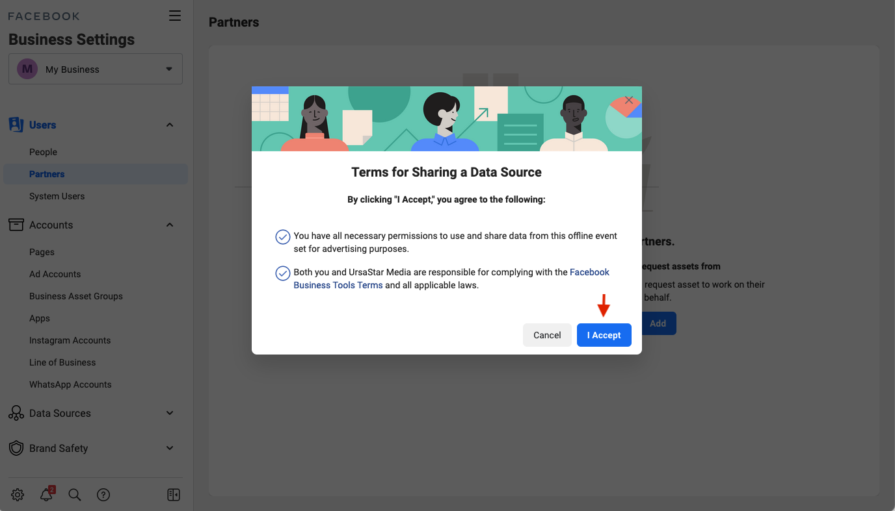
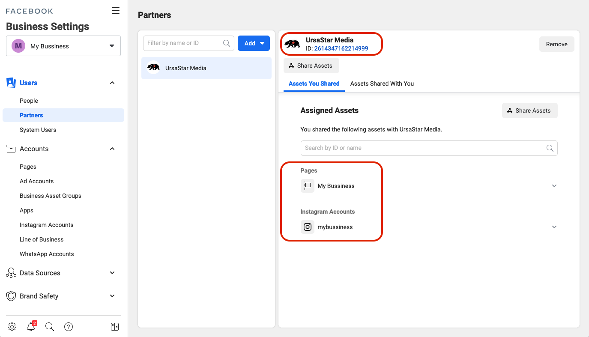

# Give a Partner Access to Assets in Your Business Manager
To add partners to your business:
- Go to [Facebook Business Settings](https://business.facebook.com/settings/partners) page.
- Below ***Users***(1), click ***Partners***(2), then click ***Add***(3).

- Enter our **Business ID** which was sent to you.

## Share access for your Facebook pages.
- Click on ***Classic Pages***(4), choose your business(5) and switch all toggle buttons to the On position(6).

- Next click on ***Instagram Accounts***(7), choose your business(8), and also toggle all buttons to the On position(9).

- Click on ***Offline Events Sets***(10), click on ***Default Offline Event...***(11) and toggle all buttons to the On position(12).

- Next press ***Save Changes*** in the lower right corner of the page.
- In the window that opens you need click on first checkbox and then press ***Next***

- And finally press ***I Accept***.

For confidence, you can go to ***Partners*** and check what you can see us as a partner.

[Link to official Facebook Help page.](https://www.facebook.com/business/help/1717412048538897?id=2190812977867143)
