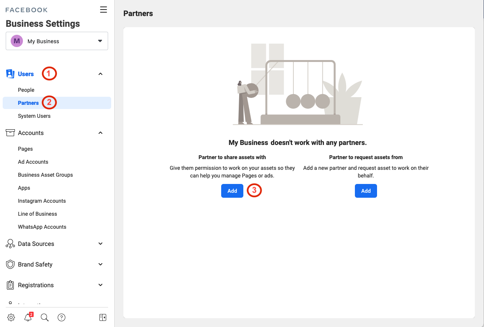

# Give a Partner Access to Assets in Your Business Manager
To add partners to your business:
- Go to [Facebook Business Settings](https://business.facebook.com/settings/partners) page.
- Below ***Users***(1), click ***Partners***(2), then click ***Add***(3).

- Enter our **Business ID** which was sent to you

- SEnter our **Business ID** that was sent to you .

[Link to official Facebook Help page.](https://www.facebook.com/business/help/1717412048538897?id=2190812977867143)
